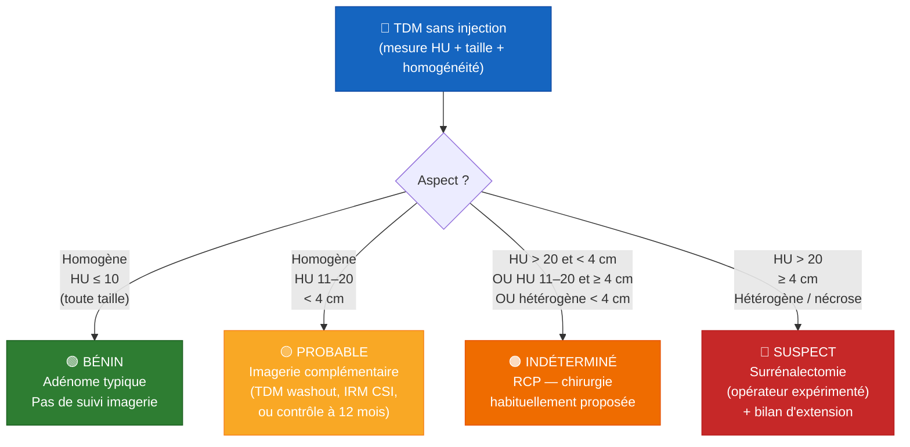

# Incidentalome surrénalien : définition, épidémiologie et algorithme décisionnel

---

## 1. Définition & épidémiologie

L'**incidentalome surrénalien** se définit comme une masse surrénalienne **≥ 1 cm découverte fortuitement** sur une imagerie réalisée pour une indication sans rapport avec une pathologie surrénalienne [[1]](#ref-1).

La majorité (≈ **80–85 %**) sont des **adénomes corticosurrénaliens bénins non fonctionnels**. Une minorité significative présente toutefois une activité hormonale ou un risque de malignité, justifiant un bilan systématique et standardisé [[1]](#ref-1) [[2]](#ref-2).

### Chiffres clés

| Donnée | Valeur | Commentaire |
|---|---|---|
| Prévalence (adulte > 70 ans, TDM/autopsie) | **5–7 %** | Augmente avec l'âge |
| Adénomes corticosurrénaliens bénins | **≈ 80 %** | Dont 40–70 % non fonctionnels |
| Sécrétion cortisolique infraclinique (MACS) | **20–50 %** | Parmi les adénomes |
| Corticosurrénalome (ACC) | **1–4 %** | Rare, mais à exclure absolument |

:::info Source
Recommandations européennes **ESE / ENSAT 2023** (Fassnacht et al., *Eur J Endocrinol*) [[1]](#ref-1).
:::

---

## 2. Algorithme décisionnel (ESE 2023)

L'évaluation repose sur **trois axes** menés en parallèle [[1]](#ref-1) [[3]](#ref-3) :

1. Une **TDM sans injection** avec mesure de densité (HU) sur une ROI couvrant ≥ 50 % de la lésion ;
2. La **taille** de la lésion (seuil clé : 4 cm) ;
3. Un **bilan biologique** systématique (test de freinage minute à 1 mg de dexaméthasone, ratio aldostérone/rénine si HTA ou hypokaliémie, métanéphrines si HU > 10).

### 2.1 Schéma décisionnel

### 2.2 Tableau récapitulatif

| Aspect TDM | Taille | Catégorie | Conduite à tenir |
|---|---|---|---|
| Homogène · **HU ≤ 10** | Toute taille | 🟢 **Bénin** | Adénome typique. Aucun suivi imagerie. Pas de métanéphrines. |
| Homogène · **HU 11–20** | &lt; 4 cm | 🟡 **Probable** | Imagerie complémentaire (TDM washout, IRM CSI) **ou** TDM à 12 mois. |
| Homogène · **HU 11–20** | ≥ 4 cm | 🟠 **Indéterminé** | RCP — chirurgie habituellement proposée. |
| Homogène · **HU > 20** | &lt; 4 cm | 🟠 **Indéterminé** | RCP — chirurgie habituellement proposée. |
| Hétérogène (nécrose, calcifications, contours irréguliers) | Toute taille | 🟠 **Indéterminé** | RCP — chirurgie habituellement, surtout si ≥ 4 cm. |
| Hétérogène · **HU > 20** | ≥ 4 cm | 🔴 **Suspect** | Surrénalectomie par opérateur expérimenté + bilan d'extension. |

:::tip Changement majeur ESE 2023
Le **seuil de 4 cm a été supprimé** pour qualifier la bénignité. Une masse **homogène ≤ 10 HU** est désormais considérée comme bénigne **quelle que soit sa taille** [[1]](#ref-1).
:::

:::warning Cas particulier — densité très négative
Une densité **HU &lt; −30 à −40** avec graisse macroscopique et calcifications oriente vers un **myélolipome** bénin (≈ 6–9 % des incidentalomes). Pas de suivi nécessaire, sauf chirurgie si symptomatique ou > 6 cm [[1]](#ref-1).
:::

:::info Bilan biologique systématique
Indépendamment des caractéristiques radiologiques, **tout incidentalome justifie** un test de freinage minute par 1 mg de dexaméthasone et la recherche d'un hyperaldostéronisme si HTA ou hypokaliémie. Les **métanéphrines** ne sont **plus systématiques** si HU ≤ 10 (allègement 2023) [[1]](#ref-1).
:::

---

## Points clés

:::tip À retenir
- Incidentalome = masse surrénalienne ≥ 1 cm découverte fortuitement ; **80–85 %** sont des adénomes bénins.
- L'évaluation repose sur **TDM sans injection (HU) + taille + bilan biologique**.
- **HU ≤ 10 homogène = bénin, quelle que soit la taille** (nouveauté ESE 2023).
- Au-delà, la décision (surveillance, imagerie complémentaire, chirurgie) dépend du couple **HU / taille** et passe en RCP.
- **MACS** (sécrétion cortisolique infraclinique) à dépister systématiquement : 20–50 % des adénomes.
:::

---

## Références

1. Fassnacht M, Tsagarakis S, Terzolo M, et al. European Society of Endocrinology clinical practice guidelines on the management of adrenal incidentalomas, in collaboration with the European Network for the Study of Adrenal Tumors. *Eur J Endocrinol*. 2023;189(1):G1-G42.
   [PubMed](https://pubmed.ncbi.nlm.nih.gov/37318239/)

2. Hong AR, Kim JH, Kim SW. Recent Updates on the Management of Adrenal Incidentalomas. *Endocrinol Metab (Seoul)*. 2023;38(4):373-380.
   [PubMed](https://pubmed.ncbi.nlm.nih.gov/37583083/)

3. Owei L, Wachtel H. The Landmark Series: Evaluation and Management of Adrenal Incidentalomas. *Ann Surg Oncol*. 2025;32(7):4712-4719.
   [PubMed](https://pubmed.ncbi.nlm.nih.gov/40304946/)
