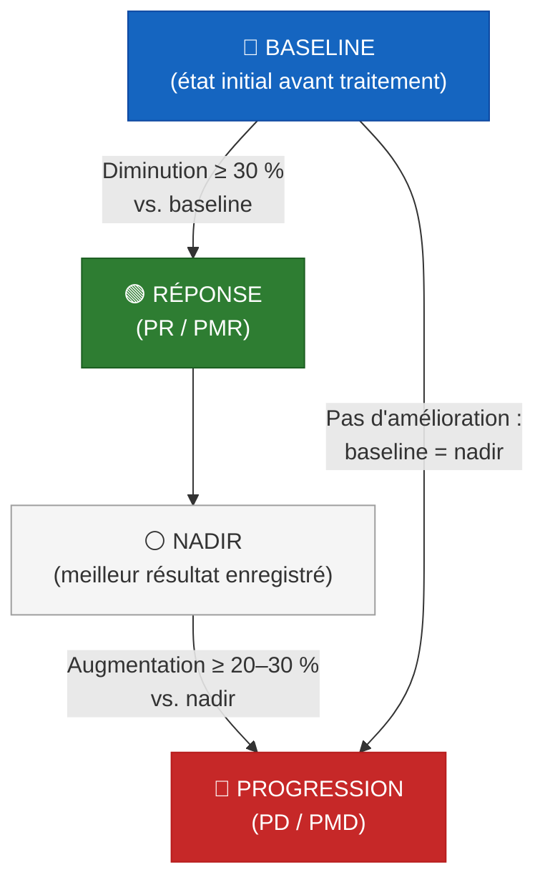

# Critères RECIST 1.1 et PERCIST 1.0 : évaluation de la réponse thérapeutique

---

## 1. Introduction

L'évaluation de la réponse thérapeutique est un pilier de la prise en charge oncologique. Elle conditionne les décisions de poursuite, modification ou arrêt du traitement, et constitue un critère de jugement majeur dans les essais cliniques.

Deux approches complémentaires coexistent :

- **L'approche anatomique** : mesure des **dimensions** tumorales en imagerie morphologique (TDM, IRM) — critères **RECIST**
- **L'approche métabolique** : mesure de l'**activité glycolytique** tumorale en TEP au [¹⁸F]FDG — critères **PERCIST**

Ces deux approches ne mesurent pas la même chose et ne répondent pas toujours de manière concordante. Comprendre leurs principes, leurs seuils et leurs limites est essentiel pour le médecin nucléaire qui doit rédiger des comptes rendus de réévaluation thérapeutique.

### Bref historique

| Année | Critères | Principe | Référence |
|-------|----------|----------|-----------|
| 1979 | **WHO** | Mesure **bidimensionnelle** (produit des 2 plus grands diamètres perpendiculaires) | Miller et al. |
| 1999 | **EORTC** | Première standardisation de l'évaluation métabolique TEP au FDG (SUV) | Young et al. [[1]](#ref-1) |
| 2000 | **RECIST 1.0** | Passage à la mesure **unidimensionnelle** (plus grand diamètre) ; max 10 lésions cibles | Therasse et al. [[2]](#ref-2) |
| 2009 | **RECIST 1.1** | Révision : max 5 lésions cibles, ganglions, seuil absolu PD +5 mm, rôle TEP | Eisenhauer et al. [[3]](#ref-3) |
| 2009 | **PERCIST 1.0** | Standardisation de l'évaluation métabolique TEP : SULpeak, référence hépatique | Wahl et al. [[4]](#ref-4) |
| 2016 | **Practical PERCIST** | Clarifications et guide pratique d'application du PERCIST 1.0 | O et al. [[5]](#ref-5) |

---

## 2. RECIST 1.1 : évaluation anatomique de la réponse

RECIST 1.1 (*Response Evaluation Criteria In Solid Tumors*, version 1.1) est le standard international pour évaluer la réponse tumorale en imagerie morphologique [[3]](#ref-3). Il repose sur la mesure **unidimensionnelle** des lésions tumorales en TDM (ou IRM).

### 2.1 Critères de mesurabilité

:::danger Définitions fondamentales
- **Lésion mesurable** (non ganglionnaire) : plus grand diamètre ≥ **10 mm** en TDM (coupes ≤ 5 mm)
- **Ganglion mesurable** : petit axe ≥ **15 mm** en TDM
- **Ganglion pathologique non mesurable** : petit axe 10–14 mm
- **Ganglion normal** : petit axe < **10 mm**
:::

Les lésions **non mesurables** comprennent notamment :
- Lésions < 10 mm
- Atteinte leptoméningée, ascite, épanchement pleural/péricardique
- Maladie inflammatoire du sein, lymphangite cutanée ou pulmonaire
- Métastases osseuses **purement blastiques** (seules les lésions lytiques ou mixtes avec **composante tissulaire** ≥ 10 mm sont mesurables)

### 2.2 Sélection des lésions cibles

| Paramètre | RECIST 1.0 (2000) | RECIST 1.1 (2009) |
|-----------|-------------------|-------------------|
| Lésions cibles totales | Max **10** | Max **5** |
| Lésions cibles par organe | Max **5** | Max **2** |

:::info Règles de sélection
- Choisir les lésions les **plus grandes** et les plus **reproductibles** en mesure
- Représentatives de l'ensemble de la charge tumorale (impliquer tous les organes atteints si possible)
- Les organes pairs comptent comme un seul organe (« poumons », « reins »)
- **Une fois cible, toujours cible** : les désignations cible/non-cible ne changent jamais au cours du suivi
:::

Toutes les autres lésions (mesurables au-delà des 5, et non mesurables) sont enregistrées comme **lésions non cibles**.

### 2.3 Mesure baseline : la somme des diamètres (SoD)

**Méthode de mesure :**
- Lésions non ganglionnaires : **plus grand diamètre** (plan axial)
- Ganglions : **petit axe** (perpendiculaire au plus grand axe)

**Somme des diamètres (SoD)** = Σ (plus grands diamètres des lésions non ganglionnaires) + Σ (petits axes des ganglions cibles)

:::warning Règles pratiques
- L'imagerie baseline doit être réalisée dans les **4 semaines** précédant le début du traitement
- Si une lésion cible **disparaît** : enregistrer **0 mm**
- Si une lésion cible est présente mais **trop petite pour être mesurée** : attribuer la valeur par défaut de **5 mm**
- Si des lésions **fusionnent** : mesurer le plus grand diamètre de la masse fusionnée
- Si une lésion se **fragmente** : additionner les plus grands diamètres des fragments
:::

### 2.4 Catégories de réponse

| Catégorie | Définition | Référence |
|-----------|-----------|-----------|
| **CR** (Complete Response) | Disparition de **toutes** les lésions cibles ; tous les ganglions cibles < 10 mm (petit axe). NB : la CR **globale** exige aussi la CR des non-cibles (cf. [section 2.7](#27-réponse-globale)) | — |
| **PR** (Partial Response) | Diminution ≥ **30 %** de la SoD | vs. **Baseline** |
| **PD** (Progressive Disease) | Augmentation ≥ **20 %** de la SoD **ET** augmentation absolue ≥ **5 mm** ; OU nouvelles lésions | vs. **Nadir** |
| **SD** (Stable Disease) | Ne remplit ni les critères de PR ni ceux de PD | Entre les deux |

:::danger Règle fondamentale
- La **réponse** (CR, PR) se juge par rapport au **baseline**
- La **progression** (PD) se juge par rapport au **nadir** (plus petite SoD enregistrée au cours du suivi)
- Les **deux critères** de PD doivent être remplis simultanément : ≥ 20 % d'augmentation relative **ET** ≥ 5 mm d'augmentation absolue
:::

:::info Pourquoi le seuil absolu de 5 mm ?
Ce seuil a été ajouté dans RECIST 1.1 pour éviter les faux positifs de progression lorsque la SoD est très petite. Exemple : une SoD nadir de 10 mm qui passe à 12 mm représente +20 %, mais seulement +2 mm — insuffisant pour affirmer une progression.
:::

#### Exemple concret

Un patient a une SoD baseline de 100 mm. Après traitement :
- **Évaluation 1** : SoD = 60 mm → −40 % vs. baseline → **PR**
- **Évaluation 2** : SoD = 50 mm → −50 % vs. baseline → **PR** (ce point est aussi le **nadir**)
- **Évaluation 3** : SoD = 62 mm → +24 % vs. nadir (50 mm) et +12 mm absolu → les deux critères sont remplis → **PD**

### 2.5 Le concept de nadir

:::tip Définition
Le **nadir** est la plus petite somme des diamètres (SoD) enregistrée à **n'importe quel moment** du suivi, y compris la mesure baseline elle-même.
:::

- Si aucune diminution de la SoD ne survient au cours du traitement, le baseline **est** le nadir
- Le nadir est la **seule** référence pour évaluer la progression (PD)
- Identifier correctement le nadir est essentiel : une erreur peut conduire à un classement erroné de la réponse

### 2.6 Lésions non cibles et nouvelles lésions

#### Évaluation des lésions non cibles

Les lésions non cibles sont évaluées **qualitativement** (pas de mesure) :

| Catégorie | Définition |
|-----------|-----------|
| **CR** | Disparition de toutes les lésions non cibles ; normalisation des marqueurs tumoraux* ; tous les ganglions < 10 mm |
| **Non-CR/Non-PD** | Persistance d'une ou plusieurs lésions non cibles et/ou marqueurs tumoraux au-dessus de la normale |
| **PD** | Progression **non équivoque** des lésions non cibles |

:::info *Marqueurs tumoraux dans RECIST 1.1
Bien que présents dans le texte original de RECIST 1.1 (Table 2) [[3]](#ref-3), les marqueurs tumoraux sont **rarement utilisés en pratique** et ne s'appliquent qu'à des cas spécifiques. Le texte de RECIST 1.1 précise : *"Because tumour markers are disease specific, instructions for their measurement should be incorporated into protocols on a disease specific basis."* Des guidelines spécifiques existent pour le CA-125 (cancer ovarien récidivant) et le PSA (cancer de prostate récidivant). Les marqueurs ne peuvent **pas être utilisés seuls** pour évaluer la réponse.
:::

:::warning Progression « non équivoque » des non-cibles
La progression des lésions non cibles doit représenter une aggravation **substantielle** de la charge tumorale globale, même en présence d'une SD ou PR des lésions cibles. Une augmentation modeste de la taille d'une lésion non cible est **insuffisante**. Le RECIST Working Group suggère comme heuristique une augmentation de volume correspondant à environ 73 % (équivalent à +20 % en diamètre pour une lésion mesurable).
:::

#### Nouvelles lésions

- L'identification doit être **non équivoque** (pas attribuable à un changement de technique d'imagerie)
- Toute nouvelle lésion = **PD**, quelle que soit la réponse des lésions cibles
- En cas de doute : poursuivre le suivi ; si confirmée, assigner la PD à la **date de première détection**

**Rôle de la TEP au [¹⁸F]FDG** (intégré dans RECIST 1.1) :
- TEP baseline négative → TEP de suivi positive (fixation > 2× le tissu environnant sur images corrigées de l'atténuation) → suggère une nouvelle lésion → **PD**
- TEP de suivi positive sur une lésion **préexistante** au TDM, sans progression anatomique → ce n'est **PAS** une PD
- La TEP ne remplace pas la mesure anatomique des lésions cibles existantes

### 2.7 Réponse globale

La réponse globale combine l'évaluation des lésions cibles, non cibles et des nouvelles lésions :

| Lésions cibles | Lésions non cibles | Nouvelles lésions | **Réponse globale** |
|---|---|---|---|
| CR | CR | Non | **CR** |
| CR | Non-CR/Non-PD | Non | **PR** |
| PR | Non-PD | Non | **PR** |
| SD | Non-PD | Non | **SD** |
| PD | Toute | Oui ou Non | **PD** |
| Toute | PD | Oui ou Non | **PD** |
| Toute | Toute | Oui | **PD** |

:::danger À retenir
- **PD l'emporte sur tout** : si un seul composant (cibles, non-cibles ou nouvelles lésions) indique PD, la réponse globale est PD
- **CR exige que tout soit CR** : lésions cibles CR + non cibles CR + pas de nouvelle lésion
- CR des cibles + Non-CR/Non-PD des non-cibles = **PR globale** (pas CR)
:::

#### Confirmation de la réponse

- **Essais non randomisés** (réponse = critère de jugement principal) : confirmation requise à ≥ **4 semaines** [[3]](#ref-3) [[13]](#ref-13)
- **Essais randomisés** : confirmation **non requise** (le bras contrôle sert de référence)

---

## 3. PERCIST 1.0 : évaluation métabolique de la réponse

PERCIST 1.0 (*PET Response Criteria In Solid Tumors*) a été proposé par Wahl et al. en 2009 [[4]](#ref-4) pour standardiser l'évaluation quantitative de la réponse métabolique en TEP au [¹⁸F]FDG. Le guide pratique « Practical PERCIST » a été publié en 2016 par la même équipe (O, Lodge et Wahl, Johns Hopkins) [[5]](#ref-5) pour clarifier son application.

### 3.1 Pourquoi une évaluation métabolique ?

Les limites de l'approche anatomique (RECIST) justifient une évaluation métabolique complémentaire :

- **Réponse métabolique précède la réponse anatomique** : les modifications du métabolisme glucidique tumoral surviennent souvent **avant** les changements de taille [[4]](#ref-4)
- **Tumeurs à réponse sans diminution de taille** : certaines tumeurs (GIST, sarcomes, mésothéliomes, hépatocarcinomes) peuvent répondre au traitement par nécrose ou transformation kystique **sans réduction de taille**, ce qui les classe faussement en SD par RECIST [[4]](#ref-4)
- **Maladie non mesurable par RECIST** : les métastases osseuses blastiques, les épanchements et les atteintes péritonéales diffuses ne sont pas mesurables en RECIST — la TEP peut néanmoins quantifier leur activité métabolique
- **Évaluation fonctionnelle** : la TEP mesure l'activité biologique tumorale, pas seulement sa taille

### 3.2 Prérequis et contrôle qualité

:::danger Prérequis indispensables pour l'application du PERCIST
Le PERCIST n'est applicable que si les conditions d'acquisition sont **standardisées** entre les examens. Sans standardisation, la comparaison quantitative est **invalide**.
:::

| Paramètre | Exigence PERCIST |
|-----------|-----------------|
| Jeûne | ≥ **4 heures** |
| Glycémie | < **200 mg/dL** (< 11,1 mmol/L) |
| Délai injection → acquisition | **50–70 minutes** |
| Différence de délai entre examens | ≤ **15 minutes** |
| Différence de dose injectée | ≤ **20 %** |
| Scanner / site | **Même** scanner et même site si possible |
| Protocole d'acquisition et de reconstruction | **Identique** entre les examens |
| Délai post-chimiothérapie | ≥ **10 jours** |
| Baseline → début traitement | ≤ **21 jours** |

### 3.3 SULpeak : la mesure de référence

:::info SUL vs SUV
PERCIST utilise le **SUL** (*Standardized Uptake value corrected for Lean body mass*) plutôt que le SUV classique (normalisé au poids corporel total). Cette correction pour la masse maigre réduit la variabilité liée à la composition corporelle, en particulier chez les patients obèses ou avec fluctuations pondérales sous traitement.
:::

**Définition du SULpeak :**
- Moyenne du SUL dans un **VOI sphérique de 1 mL** (diamètre ≈ 1,2 cm) centré sur la zone la plus active de la tumeur
- Ce n'est **pas** le SULmax (valeur du voxel le plus intense) : le SULpeak est une valeur moyenne dans un petit volume, ce qui le rend **moins sensible au bruit statistique**
- Le SULpeak ne contient pas nécessairement le voxel de SUL maximum

:::warning SULpeak ≠ SUVmax
Le SULpeak est plus reproductible que le SUVmax car il moyenne le signal sur 1 mL au lieu d'utiliser un seul voxel. C'est un paramètre fondamental du PERCIST.
:::

**Formules de masse maigre (Lean Body Weight) :**
- Hommes : LBW = 1,1 × Poids (kg) − 128 × (Poids/Taille)² (Poids en kg, Taille en cm)
- Femmes : LBW = 1,07 × Poids (kg) − 148 × (Poids/Taille)²

### 3.4 Référence hépatique

Le foie sert de **référence interne** pour vérifier la qualité de l'examen et établir le seuil de mesurabilité.

**Placement du VOI hépatique :**
- VOI sphérique de **3 cm de diamètre**
- Placé dans le **lobe droit du foie**, à mi-distance entre le dôme hépatique et le bord inférieur
- Excluant les voies biliaires centrales et les vaisseaux
- Mesurer : **SUL moyen** et **écart-type** (2 chiffres significatifs [[5]](#ref-5))

:::tip Outils automatiques
Les consoles modernes (Siemens syngo.via, GE PETVCAR, Philips IntelliSpace) disposent d'outils de placement **automatique** du VOI hépatique de référence, ce qui standardise et accélère la mesure.
:::

:::warning Foie pathologique
Si le foie est envahi par des métastases ou si la mesure hépatique n'est pas fiable, utiliser l'**aorte thoracique descendante** comme alternative :
- VOI cylindrique de **1 cm de diamètre × 2 cm de long**
- Au centre de l'aorte thoracique descendante, excluant la paroi
- Cette mesure alternative est également disponible en automatique sur les consoles modernes
:::

### 3.5 Seuil de mesurabilité

:::danger Règle de mesurabilité PERCIST
Une lésion n'est **mesurable** que si son SULpeak dépasse le seuil suivant :

**SULpeak ≥ 1,5 × SUL moyen hépatique + 2 × écart-type hépatique**

Si la référence aortique est utilisée :

**SULpeak ≥ 2 × SUL moyen aortique + 2 × écart-type aortique**
:::

- Les lésions en dessous de ce seuil sont considérées comme **non mesurables** en PERCIST
- Ce seuil garantit que la fixation tumorale est significativement supérieure au bruit de fond
- Le critère de mesurabilité ne s'applique qu'au **baseline** : une lésion initialement mesurable qui passe sous le seuil après traitement reflète une réponse, pas une perte de mesurabilité [[5]](#ref-5)

### 3.6 Sélection de la lésion cible : un concept majeur

:::danger Différence fondamentale avec RECIST
En **RECIST**, les lésions cibles sont **fixées** au baseline et suivies tout au long du traitement (« une fois cible, toujours cible »).

En **PERCIST**, la lésion cible est la **plus active métaboliquement à chaque évaluation** — ce qui peut correspondre à des **lésions différentes** entre le baseline et le suivi [[5]](#ref-5).
:::

- PERCIST évalue **une seule lésion cible** : celle avec le **SULpeak le plus élevé** à chaque temps d'évaluation
- Jusqu'à 5 lésions optionnelles peuvent être suivies (données exploratoires)
- **La lésion la plus active peut changer** : si la lésion la plus « chaude » au baseline répond bien au traitement, une autre lésion peut devenir la plus active au suivi — c'est cette nouvelle lésion qui sera mesurée
- Conséquence pratique : le SULpeak de suivi n'est **pas nécessairement mesuré sur la même lésion** que le baseline

### 3.7 Catégories de réponse

| Catégorie | Définition | Référence |
|-----------|-----------|-----------|
| **CMR** (Complete Metabolic Response) | Résolution complète de la fixation FDG dans la lésion cible : SULpeak **< SUL moyen hépatique** et **indiscernable du bruit de fond vasculaire** (*blood pool*) ; disparition de toutes les autres lésions au niveau du bruit de fond ; pas de nouvelles lésions FDG-avides | — |
| **PMR** (Partial Metabolic Response) | Diminution ≥ **30 %** du SULpeak **ET** diminution absolue ≥ **0,8 unité SUL** ; pas de nouvelles lésions ; pas d'augmentation > 30 % des autres lésions | vs. **Baseline** |
| **SMD** (Stable Metabolic Disease) | Ne remplit ni les critères de PMR ni ceux de PMD | Entre les deux |
| **PMD** (Progressive Metabolic Disease) | Augmentation ≥ **30 %** du SULpeak **ET** augmentation absolue ≥ **0,8 unité SUL** ; OU nouvelles lésions FDG-avides ; OU augmentation > 75 % de la TLG ; OU augmentation > 30 % de la taille anatomique de la lésion cible | vs. **Nadir** |

:::danger Double critère obligatoire
Comme pour RECIST, le PERCIST impose un **double critère** pour la PMR et la PMD :
- Variation **relative** ≥ 30 %
- **ET** variation **absolue** ≥ 0,8 unité SUL

Ceci évite les faux classements lorsque les valeurs de SUL sont basses (une variation de 30 % sur un SULpeak de 1,5 ne représente que 0,45 unité — insuffisant pour affirmer un changement significatif).
:::

**Formule de calcul :**

% de variation = [(SULpeak suivi − SULpeak référence) ÷ SULpeak référence] × 100

:::tip Format de reporting PERCIST
PERCIST recommande un reporting structuré incluant le % de variation, le temps depuis le début du traitement (en semaines) et la présence/nombre de nouvelles lésions. Exemple : **PMR −40, 3** (réponse partielle de −40 % à la semaine 3) ou **PMD +35, 4, new: 5** (progression de +35 % à la semaine 4 avec 5 nouvelles lésions).
:::

### 3.8 Concept de nadir en PERCIST

Comme en RECIST, le principe est le même :

- La **PMR** s'évalue par rapport au **baseline**
- La **PMD** s'évalue par rapport au **nadir** (meilleure réponse enregistrée = SULpeak le plus bas de la lésion la plus active au cours du suivi)
- Si aucune amélioration n'a été observée, le nadir **est** le baseline

### 3.9 Évaluation par la TLG (Total Lesion Glycolysis)

En plus du SULpeak, PERCIST propose la **TLG** comme paramètre exploratoire secondaire [[4]](#ref-4) :

- La TLG est calculée sur les voxels dont le SUL est > 2 écarts-types au-dessus du SUL moyen hépatique
- **Critère de progression par TLG** : augmentation ≥ **75 %** de la TLG (ce seuil de 75 % est cohérent avec une augmentation de +20 % en diamètre linéaire selon EORTC, qui correspond à +73 % en volume)
- **Critère de réponse par TLG** : diminution ≥ **45 %** proposée comme point de départ, mais les données restent insuffisantes pour des recommandations fermes

:::info TLG = endpoint secondaire
La Table 7 de Wahl 2009 précise que la TLG ne doit pas être un critère primaire à ce stade (*"It should not be a primary metric, but a secondary endpoint at this time"*), mais un critère secondaire exploratoire. Des détails méthodologiques explicites doivent être fournis si la TLG est utilisée.
:::

### 3.10 Combien de lésions évaluer ?

PERCIST 1.0 évalue en priorité **une seule lésion** (la plus active), mais reconnaît que cela est une limitation potentielle [[4]](#ref-4) :

- Les lésions et leurs réponses sont **hautement corrélées** en général
- Une **option exploratoire** est d'évaluer jusqu'à **5 lésions** (les 5 plus actives, ou les 5 identifiées par RECIST 1.1, max 2 par organe)
- Si 5 lésions sont utilisées, la somme des SULpeak des 5 lésions au baseline sert de référence, et la somme des mêmes 5 lésions au suivi est comparée
- Des études complémentaires sont nécessaires pour déterminer le nombre optimal de lésions à évaluer

:::info Question ouverte
Le nombre optimal de lésions à évaluer en PERCIST reste un sujet de recherche. L'article original conclut : *"Additional data are required to determine how many lesions should be assessed over 1."*
:::

### 3.11 Quand PERCIST défère à RECIST

PERCIST reconnaît ses propres limites et **défère à RECIST 1.1** dans les situations suivantes [[4]](#ref-4) :

- Tumeurs **non FDG-avides** (carcinome rénal à cellules claires, carcinome mucineux, carcinome bronchioloalvéolaire, certains cancers de la prostate)
- Examen **techniquement inadéquat** (non-respect des conditions de standardisation)
- Fixation tumorale **sous le seuil de mesurabilité** PERCIST

---

## 4. Concepts fondamentaux : baseline, nadir, réponse et progression

Cette section synthétise les concepts communs aux deux systèmes, qui sont souvent source de confusion.

### 4.1 Baseline : la référence initiale

| | RECIST 1.1 | PERCIST 1.0 |
|---|---|---|
| **Définition** | Somme des diamètres (SoD) des lésions cibles avant traitement | SULpeak de la lésion la plus active avant traitement |
| **Délai avant traitement** | ≤ 4 semaines | ≤ 21 jours |
| **Rôle** | Référence pour évaluer la **réponse** (CR, PR) | Référence pour évaluer la **réponse** (CMR, PMR) |

### 4.2 Nadir : le meilleur résultat

| | RECIST 1.1 | PERCIST 1.0 |
|---|---|---|
| **Définition** | Plus petite SoD enregistrée au cours du suivi (peut être le baseline) | SULpeak le plus bas enregistré pour la lésion la plus active (peut être le baseline) |
| **Rôle** | Référence pour évaluer la **progression** (PD) | Référence pour évaluer la **progression** (PMD) |

### 4.3 La règle d'or

:::danger Règle universelle (RECIST et PERCIST)
- **Réponse** = variation par rapport au **BASELINE**
- **Progression** = variation par rapport au **NADIR** (meilleure réponse enregistrée)

Cette asymétrie est fondamentale : la réponse mesure l'efficacité par rapport à l'état initial, tandis que la progression détecte une aggravation par rapport au meilleur résultat obtenu. Si aucune amélioration n'a été observée, le nadir est le baseline.
:::

### 4.4 Le SUV comme variable continue

:::tip Perspective PERCIST
Wahl et al. soulignent que la réponse tumorale en TEP est une **variable continue et dépendante du temps** [[4]](#ref-4). Les catégories CMR/PMR/SMD/PMD sont des simplifications d'un continuum. Les représentations en **waterfall plots** (graphiques en cascade) montrant le % de variation du SULpeak pour chaque patient permettent une visualisation plus riche de la réponse au sein d'une cohorte.
:::

---

## 5. Comparaison RECIST 1.1 vs PERCIST 1.0

### 5.1 Tableau comparatif synthétique

| Paramètre | RECIST 1.1 | PERCIST 1.0 |
|-----------|-----------|------------|
| **Type d'imagerie** | TDM (ou IRM) | TEP au [¹⁸F]FDG |
| **Ce qui est mesuré** | Taille tumorale (diamètre) | Activité métabolique (SULpeak) |
| **Paramètre principal** | Somme des diamètres (SoD) | SULpeak (VOI 1 mL, ≈ 1,2 cm) |
| **Nb lésions cibles** | Max 5 (fixées au baseline, « une fois cible, toujours cible ») | 1 (la **plus active à chaque évaluation**, peut changer entre les examens) |
| **Seuil de réponse** | ≥ 30 % diminution de SoD | ≥ 30 % diminution de SULpeak ET ≥ 0,8 SUL |
| **Seuil de progression** | ≥ 20 % augmentation de SoD ET ≥ 5 mm | ≥ 30 % augmentation de SULpeak ET ≥ 0,8 SUL |
| **Référence pour réponse** | Baseline (SoD initiale) | Baseline (SULpeak initial) |
| **Référence pour progression** | Nadir (plus petite SoD enregistrée) | Nadir (plus petit SULpeak enregistré pour la lésion la plus active) |
| **Référence interne** | Aucune | Foie (VOI 3 cm) ou aorte |
| **Nouvelles lésions** | Non équivoques → PD | FDG-avides typiques → PMD |
| **Tumeurs non avides** | Applicable | Défère à RECIST 1.1 |
| **Réponse complète** | Disparition de toutes les lésions ; ganglions < 10 mm | SULpeak < SUL moyen hépatique |
| **Validation** | Très largement validé (>6 500 patients) | Moins validé ; standard en développement |

### 5.2 Discordances et leur signification clinique

RECIST et PERCIST sont discordants dans **14 à 63 %** des cas selon les études et les pathologies [[6]](#ref-6) [[7]](#ref-7). Dans une analyse poolée de 268 patients (tumeurs solides diverses), **37,7 %** des patients avaient des réponses discordantes entre RECIST et PERCIST, avec un taux de réponse globale de 35,1 % (RECIST) contre 54,1 % (PERCIST) (p < 0,0001) [[11]](#ref-11). Cette discordance n'est pas un défaut : elle reflète la complémentarité des deux approches.

#### Patterns de discordance fréquents

| Situation | RECIST | PERCIST | Explication |
|-----------|--------|---------|-------------|
| Réponse métabolique précoce sans réduction de taille | SD | PMR | La diminution de l'activité métabolique **précède** la réduction de taille |
| Nécrose tumorale sans diminution de taille | SD | PMR/CMR | Tumeur « morte » métaboliquement mais volume préservé (GIST, sarcomes) |
| Augmentation de taille avec baisse d'activité | PD | PMR | Hémorragie intratumorale, transformation kystique, pseudoprogression |
| Nouvelles lésions FDG-avides sans masse visible en TDM | SD | PMD | Détection métabolique plus précoce de nouvelles localisations |

:::warning Tumeurs à risque de discordance
Les discordances sont particulièrement fréquentes dans :
- **GIST** (tumeurs stromales gastro-intestinales) sous imatinib
- **Sarcomes** sous thérapie ciblée
- **Mésothéliomes**
- **Hépatocarcinomes**
- **Tumeurs traitées par immunothérapie** (pseudoprogression)
:::

### 5.3 Études comparatives RECIST vs. PERCIST

La littérature comparant directement RECIST et PERCIST reste **limitée en volume et en qualité méthodologique**. Les études disponibles sont principalement rétrospectives, monocentriques, avec de faibles effectifs. Leurs résultats doivent être interprétés avec prudence.

| Étude | Pathologie / Traitement | n | Concordance (κ) | Résultat principal | Limites |
|-------|------------------------|---|-----------------|-------------------|---------|
| Yanagawa 2016 [[7]](#ref-7) | CBNPC / chimiothérapie | 45 | 0,139 (faible) | PERCIST prédit mieux la PFS que RECIST ; PMR associée à meilleure survie | Rétrospectif, monocentrique, effectif modeste |
| Anwar 2015 [[8]](#ref-8) | CBNPC métastatique / chimiothérapie | 30 | — | PERCIST facteur pronostique indépendant de survie globale (multivariée), pas RECIST | Très petit effectif (n = 30), rétrospectif |
| Goldfarb 2019 [[6]](#ref-6) | CBNPC / immunothérapie anti-PD-(L)1 | 39 | 0,581 (modéré) | Concordance 85,8 % ; les deux critères prédisent la survie (p < 0,001) | Monocentrique, faible effectif |
| Seban 2020 [[9]](#ref-9) | CBNPC / nivolumab | 48 | 0,346 (faible) | PMR garde une valeur pronostique même chez les patients classés PD en RECIST | Rétrospectif, une seule molécule |
| Taha 2025 [[10]](#ref-10) | TNE / PRRT (⁷⁷Lu) | 42 | PERCIST 0,921 vs RECIST 0,897 | Meilleure reproductibilité inter-lecteur pour PERCIST | Pas de corrélation avec la survie rapportée |
| Li 2025 [[12]](#ref-12) | CBNPC / immunochimiothérapie néoadjuvante | 53 | — | Sensibilité pCR : RECIST 10,5 % vs PERCIST 73,7 % | Monocentrique, analyse ancillaire, seuils à confirmer |

:::warning Niveau de preuve
Aucun essai prospectif randomisé n'a comparé la prise de décision thérapeutique basée sur RECIST vs. PERCIST. Les données actuelles proviennent d'études observationnelles rétrospectives avec des effectifs modestes (30–53 patients). Une méta-analyse poolée [[11]](#ref-11) suggère une discordance globale de 30–40 %, mais l'hétérogénéité des études (pathologies, traitements, protocoles TEP) limite la portée de ces résultats.
:::

### 5.4 Avantages et limites

#### RECIST 1.1

| Avantages | Limites |
|-----------|---------|
| Largement validé et universellement adopté | Ne mesure que la taille (pas la viabilité) |
| Applicable à toutes les tumeurs solides | Variabilité de mesure inter-observateur (1–3 mm) |
| Standard réglementaire (FDA, EMA) | Maladie non mesurable (os, effusions, méningite) |

#### PERCIST 1.0

| Avantages | Limites |
|-----------|---------|
| Détection plus précoce de la réponse | Exige une standardisation stricte du protocole TEP |
| Évalue la viabilité tumorale, pas seulement la taille | Non applicable aux tumeurs non FDG-avides |
| Meilleur prédicteur de survie dans certaines pathologies | Moins validé que RECIST (pas de data warehouse > 6 500 patients) |

---

## 6. Points clés

:::tip Points clés
- **RECIST 1.1** évalue la **taille** tumorale (SoD), **PERCIST 1.0** évalue l'**activité métabolique** (SULpeak) — ce sont des approches **complémentaires**, pas concurrentes
- Les deux systèmes partagent le même principe : **réponse vs. baseline**, **progression vs. nadir**
- En PERCIST, la lésion cible est la **plus active à chaque évaluation** (peut changer entre examens) ; en RECIST, les cibles sont **fixées** au baseline
- Le **seuil de réponse** est identique : **≥ 30 %** de diminution dans les deux systèmes
- Le **seuil de progression** diffère : **≥ 20 %** + 5 mm (RECIST) vs. **≥ 30 %** + 0,8 SUL (PERCIST)
- Les deux systèmes imposent un **double critère** (relatif ET absolu) pour la progression, évitant les faux positifs sur de petites valeurs
- La réponse métabolique **précède** souvent la réponse anatomique — intérêt de la TEP pour la détection précoce
- PERCIST **défère à RECIST** pour les tumeurs non FDG-avides
- L'application du PERCIST exige une **standardisation rigoureuse** du protocole TEP entre les examens (délai injection-acquisition ±15 min, même scanner, même reconstruction)
- Le SULpeak (VOI 1 mL, ≈ 1,2 cm) est plus reproductible que le SUVmax (voxel unique)
- Les discordances RECIST/PERCIST sont **fréquentes** (14–63 %) et cliniquement informatives
:::

---

## Références

1. Young H, Baum R, Cremerius U, et al. Measurement of clinical and subclinical tumour response using [18F]-fluorodeoxyglucose and positron emission tomography: review and 1999 EORTC recommendations. *Eur J Cancer*. 1999;35(13):1773-1782.
   [PubMed](https://pubmed.ncbi.nlm.nih.gov/10673991/)

2. Therasse P, Arbuck SG, Eisenhauer EA, et al. New guidelines to evaluate the response to treatment in solid tumors. *J Natl Cancer Inst*. 2000;92(3):205-216.
   [PubMed](https://pubmed.ncbi.nlm.nih.gov/10655437/)

3. Eisenhauer EA, Therasse P, Bogaerts J, et al. New response evaluation criteria in solid tumours: revised RECIST guideline (version 1.1). *Eur J Cancer*. 2009;45(2):228-247.
   [PubMed](https://pubmed.ncbi.nlm.nih.gov/19097774/)

4. Wahl RL, Jacene H, Kasamon Y, et al. From RECIST to PERCIST: Evolving Considerations for PET Response Criteria in Solid Tumors. *J Nucl Med*. 2009;50(Suppl 1):122S-150S.
   [PubMed](https://pubmed.ncbi.nlm.nih.gov/19403881/)

5. O JH, Lodge MA, Wahl RL. Practical PERCIST: A Simplified Guide to PET Response Criteria in Solid Tumors 1.0. *Radiology*. 2016;280(2):576-584.
   [PubMed](https://pubmed.ncbi.nlm.nih.gov/26909647/)

6. Goldfarb L, Duchemann B, Chouahnia K, et al. Comparison of RECIST, iRECIST, and PERCIST for the Evaluation of Response to PD-1/PD-L1 Blockade Therapy in Patients With Non-Small Cell Lung Cancer. *Clin Nucl Med*. 2019;44(7):535-541.
   [PubMed](https://pubmed.ncbi.nlm.nih.gov/31021918/)

7. Yanagawa M, Tatsumi M, Miyata T, et al. Comparison of RECIST, EORTC criteria and PERCIST for evaluation of early response to chemotherapy in patients with non-small-cell lung cancer. *Eur J Nucl Med Mol Imaging*. 2016;43(11):1945-1953.
   [PubMed](https://pubmed.ncbi.nlm.nih.gov/27236466/)

8. Anwar H, Sachpekidis C, Engel C, et al. Comparison of metabolic and anatomic response to chemotherapy based on PERCIST and RECIST in patients with advanced stage non-small cell lung cancer. *Asian Pac J Cancer Prev*. 2015;15(22):9557-9563.
    [PubMed](https://pubmed.ncbi.nlm.nih.gov/25640373/)

9. Seban RD, Mezquita L, Beber A, et al. Comparison Between 18F-FDG PET-Based and CT-Based Criteria in Non-Small Cell Lung Cancer Patients Treated with Nivolumab. *J Nucl Med*. 2020;61(4):564-570.
    [PubMed](https://pubmed.ncbi.nlm.nih.gov/31806768/)

10. Taha A, Tareen K, Goel S, et al. Comparison of RECIST 1.1, mRECIST and PERCIST for assessment of peptide receptor radionuclide therapy treatment response in metastatic neuroendocrine tumors. *Curr Probl Diagn Radiol*. 2025;54(1):72-78.
    [PubMed](https://pubmed.ncbi.nlm.nih.gov/39389807/)

11. Min SJ, Jang HJ, Kim JH. Comparison of the RECIST and PERCIST criteria in solid tumors: a pooled analysis and review. *Oncotarget*. 2016;7(19):27848-27854.
    [PubMed](https://pubmed.ncbi.nlm.nih.gov/27517621/)

12. Li J, Wang H, Chen Y, et al. Quantitative 18F-FDG PET/CT Model for predicting pathological complete response to neoadjuvant immunochemotherapy in NSCLC: comparison with RECIST 1.1 and PERCIST. *Eur J Nucl Med Mol Imaging*. 2025;52(10):3354-3364.
    [PubMed](https://pubmed.ncbi.nlm.nih.gov/40418330/)

13. Schwartz LH, Litière S, de Vries E, et al. RECIST 1.1 — Update and clarification: From the RECIST committee. *Eur J Cancer*. 2016;62:132-137.
    [PubMed](https://pubmed.ncbi.nlm.nih.gov/27189322/)
